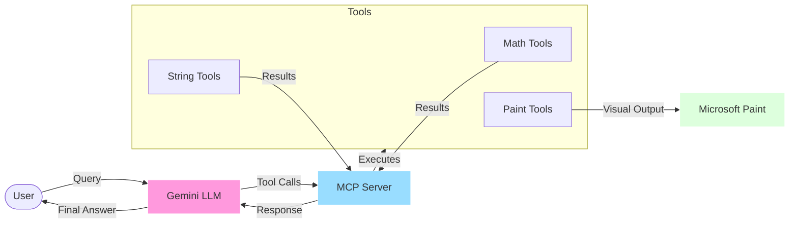
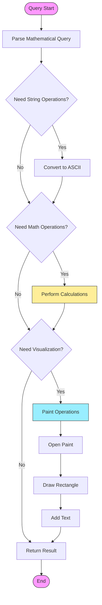
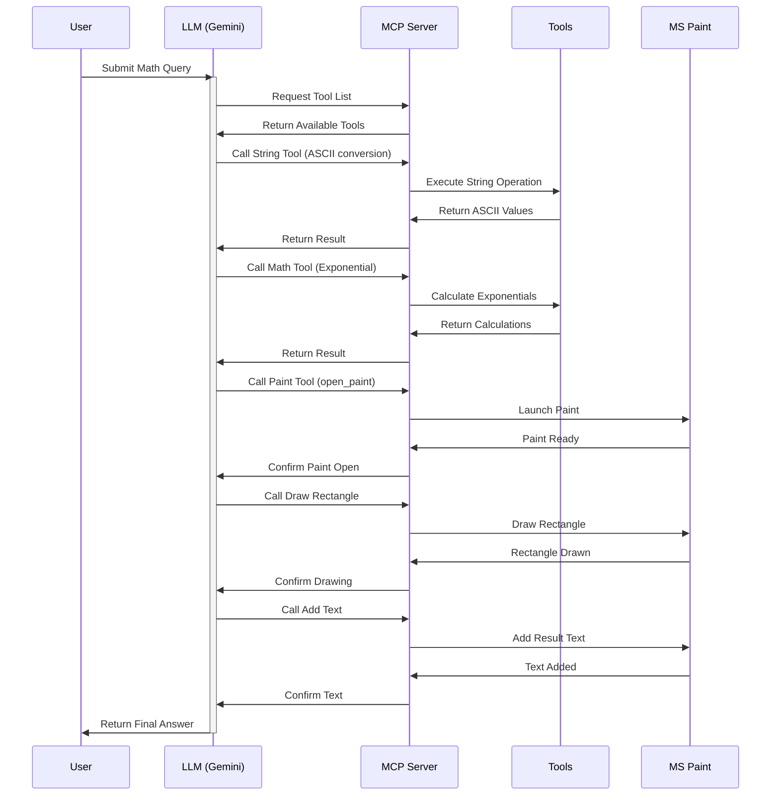

# AI Math Agent with Paint Visualization 🧮🎨

## Overview
This project demonstrates an innovative approach to mathematical problem-solving using a Large Language Model (Gemini) combined with visual output through Microsoft Paint. The agent not only solves mathematical problems but also automatically visualizes the results.

<!-- 
*(Create an architecture diagram showing: LLM -> MCP Server -> Tools -> Paint)* -->

## System Architecture



## Features
- 🤖 Uses Gemini LLM for mathematical problem-solving
- 🛠️ Implements Multiple Tool Integration via MCP (Model-Control-Panel)
- 🎨 Automatic visualization in Microsoft Paint
- 📊 Real-time problem breakdown and solution steps
- 🔄 Iterative problem-solving approach

## System Architecture

### Components
1. **LLM (Gemini)**: Handles problem interpretation and solution strategy
2. **MCP Server**: Manages tool interactions
3. **Tool Suite**: 
   - Mathematical operations (add, subtract, multiply, etc.)
   - String manipulation
   - Paint operations (drawing, text addition)

<!-- 
*(Create a flowchart showing how tools interact)* -->

### Tool Interaction Flow



## Example Use Case

```python
Query: "Find the ASCII values of characters in INDIA and then return sum of exponentials of those values"
```

### Solution Steps:
1. Convert "INDIA" to ASCII values
2. Calculate exponentials
3. Sum the results
4. Visualize in Paint


*(Add a screenshot of Paint output)*

## Installation

### Prerequisites
- Python 3.8+
- Microsoft Paint
- Gemini API access

### Setup
```bash
# Clone the repository
git clone https://github.com/yourusername/ai-math-agent.git

# Install dependencies
pip install -r requirements.txt

# Set up environment variables
cp .env.example .env
# Add your Gemini API key to .env
```

## Project Structure
```
.
├── Session25/
│   ├── talk2mcp.py      # Main application file
│   ├── example2.py      # MCP server implementation
├── requirements.txt
└── README.md
```

## How It Works

<!-- 
*(Create a sequence diagram showing the interaction flow)* -->

### Sequence Diagram



1. **Problem Input**: User provides a mathematical query
2. **LLM Processing**: 
   - Analyzes the problem
   - Breaks it down into steps
   - Determines required tools
3. **Tool Execution**:
   - Makes appropriate tool calls
   - Processes intermediate results
4. **Visualization**:
   - Opens Paint
   - Creates visual frame
   - Displays result

## Tool List
- Mathematical Operations
  - `add(a: int, b: int) -> int`
  - `subtract(a: int, b: int) -> int`
  - `multiply(a: int, b: int) -> int`
  - More...
- String Operations
  - `strings_to_chars_to_int(string: str) -> list[int]`
- Paint Operations
  - `open_paint()`
  - `draw_rectangle(x: int, y: int, width: int, height: int)`
  - `add_text_in_paint(text: str)`

## Usage

```bash
python Session25/talk2mcp.py
```

## Demo

*(Create a GIF showing the entire process)*

## Contributing
Contributions are welcome! Please feel free to submit a Pull Request.

## License
This project is licensed under the MIT License - see the [LICENSE](LICENSE) file for details.

## Acknowledgments
- Gemini API for LLM capabilities
- MCP framework for tool integration
- Contributors and testers

## Future Improvements
- [ ] Add more mathematical operations
- [ ] Enhance visualization capabilities
- [ ] Support for complex mathematical notations
- [ ] Multiple visualization options
