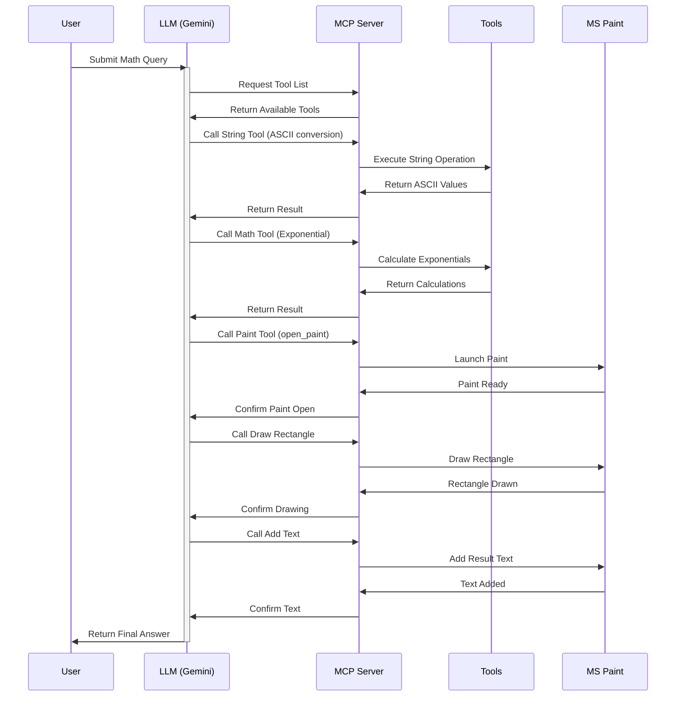

# AI Math Agent with Paint Visualization 🧮🎨

## Overview
This project demonstrates an innovative approach to mathematical problem-solving using a Large Language Model (Gemini) combined with visual output through Microsoft Paint. The agent not only solves mathematical problems but also automatically visualizes the results.

<!-- 
*(Create an architecture diagram showing: LLM -> MCP Server -> Tools -> Paint)* -->

## System Architecture



```mermaid
graph LR
    User([User]) --> |Query| LLM[Gemini LLM]
    LLM --> |Tool Calls| MCP[MCP Server]
    
    subgraph Tools
        Math[Math Tools]
        String[String Tools]
        Paint[Paint Tools]
    end
    
    MCP --> |Executes| Tools
    Math --> |Results| MCP
    String --> |Results| MCP
    Paint --> |Visual Output| MSPaint[Microsoft Paint]
    
    MCP --> |Response| LLM
    LLM --> |Final Answer| User

    style LLM fill:#6e2355,stroke:#333
    style MCP fill:#164157,stroke:#333
    style MSPaint fill:#093809,stroke:#333
```

## Features
- 🤖 Uses Gemini LLM for mathematical problem-solving
- 🛠️ Implements Multiple Tool Integration via MCP (Model-Control-Panel)
- 🎨 Automatic visualization in Microsoft Paint
- 📊 Real-time problem breakdown and solution steps
- 🔄 Iterative problem-solving approach

## System Architecture

### Components
1. **LLM (Gemini)**: Handles problem interpretation and solution strategy
2. **MCP Server**: Manages tool interactions
3. **Tool Suite**: 
   - Mathematical operations (add, subtract, multiply, etc.)
   - String manipulation
   - Paint operations (drawing, text addition)

<!-- 
*(Create a flowchart showing how tools interact)* -->

### Tool Interaction Flow

```mermaid
flowchart TD
    Start([Query Start]) --> Parse[Parse Mathematical Query]
    Parse --> StringOp{Need String Operations?}
    
    StringOp -->|Yes| ASCII[Convert to ASCII]
    StringOp -->|No| MathOp{Need Math Operations?}
    
    ASCII --> MathOp
    
    MathOp -->|Yes| Calculate[Perform Calculations]
    MathOp -->|No| Visual{Need Visualization?}
    
    Calculate --> Visual
    
    Visual -->|Yes| Paint[Paint Operations]
    Visual -->|No| Result[Return Result]
    
    Paint --> OpenPaint[Open Paint]
    OpenPaint --> DrawRect[Draw Rectangle]
    DrawRect --> AddText[Add Text]
    AddText --> Result
    
    Result --> End([End])

    style Start fill:#6e2355,stroke:#333
    style End fill:#6e2355,stroke:#333
    style Paint fill:#164157,stroke:#333
    style Calculate fill:#093809,stroke:#333
```



## Example Use Case

```python
Query: "Find the ASCII values of characters in INDIA and then return sum of exponentials of those values"
```

### Solution Steps:
1. Convert "INDIA" to ASCII values
2. Calculate exponentials
3. Sum the results
4. Visualize in Paint

<b> Example Output </b>


## Installation

### Prerequisites
- Python 3.8+
- Microsoft Paint
- Gemini API access

### Setup
```bash
# Clone the repository
git clone https://github.com/yourusername/ai-math-agent.git

# Install dependencies
pip install -r requirements.txt

# Set up environment variables
cp .env.example .env
# Add your Gemini API key to .env
```

## Project Structure
```
.
├── Session25/
│   ├── talk2mcp.py      # Main application file
│   ├── example2.py      # MCP server implementation
├── requirements.txt
└── README.md
```

## How It Works

<!-- 
*(Create a sequence diagram showing the interaction flow)* -->

### Sequence Diagram



1. **Problem Input**: User provides a mathematical query
2. **LLM Processing**: 
   - Analyzes the problem
   - Breaks it down into steps
   - Determines required tools
3. **Tool Execution**:
   - Makes appropriate tool calls
   - Processes intermediate results
4. **Visualization**:
   - Opens Paint
   - Creates visual frame
   - Displays result

## Tool List
- Mathematical Operations
  - `add(a: int, b: int) -> int`
  - `subtract(a: int, b: int) -> int`
  - `multiply(a: int, b: int) -> int`
  - More...
- String Operations
  - `strings_to_chars_to_int(string: str) -> list[int]`
- Paint Operations
  - `open_paint()`
  - `draw_rectangle(x: int, y: int, width: int, height: int)`
  - `add_text_in_paint(text: str)`

## Usage

```bash
python Session25/talk2mcp.py
```

## Demo
<!--
*(Create a GIF showing the entire process)*-->


<b> LLM Logs</b>

```
Starting main execution...
Establishing connection to MCP server...   
Connection established, creating session...
Session created, initializing...
Requesting tool list...
Successfully retrieved 22 tools
Creating system prompt...
Number of tools: 22
Added description for tool: 1. add(a: integer, b: integer) - Add two numbers
Added description for tool: 2. add_list(l: array) - Add all numbers in a list
Added description for tool: 3. subtract(a: integer, b: integer) - Subtract two numbers
Added description for tool: 4. multiply(a: integer, b: integer) - Multiply two numbers
Added description for tool: 5. divide(a: integer, b: integer) - Divide two numbers
Added description for tool: 6. power(a: integer, b: integer) - Power of two numbers
Added description for tool: 7. sqrt(a: integer) - Square root of a number
Added description for tool: 8. cbrt(a: integer) - Cube root of a number
Added description for tool: 9. factorial(a: integer) - factorial of a number
Added description for tool: 10. log(a: integer) - log of a number
Added description for tool: 11. remainder(a: integer, b: integer) - remainder of two numbers divison
Added description for tool: 12. sin(a: integer) - sin of a number
Added description for tool: 13. cos(a: integer) - cos of a number
Added description for tool: 14. tan(a: integer) - tan of a number
Added description for tool: 15. mine(a: integer, b: integer) - special mining tool
Added description for tool: 16. create_thumbnail(image_path: string) - Create a thumbnail from an image
Added description for tool: 17. strings_to_chars_to_int(string: string) - Return the ASCII values of the characters in a word 
Added description for tool: 18. int_list_to_exponential_sum(int_list: array) - Return sum of exponentials of numbers in a list
Added description for tool: 19. fibonacci_numbers(n: integer) - Return the first n Fibonacci Numbers
Added description for tool: 20. draw_rectangle(x: integer, y: integer, width: integer, height: integer) -
Draws a rectangle freehand by dragging the mouse.
Coordinates must be inside the white canvas region.

Added description for tool: 21. add_text_in_paint(number: integer, x: integer, y: integer, box_w: integer, box_h: integer) - Add text in Paint
Added description for tool: 22. open_paint() - Open Microsoft Paint maximized on secondary monitor
Successfully created tools description
Created system prompt...
Starting iteration loop...

--- Iteration 1 ---
Preparing to generate LLM response...
Starting LLM generation...
LLM generation completed
LLM Response: FUNCTION_CALL: strings_to_chars_to_int|INDIA

DEBUG: Raw function info:  strings_to_chars_to_int|INDIA
DEBUG: Split parts: ['strings_to_chars_to_int', 'INDIA']
DEBUG: Function name: strings_to_chars_to_int
DEBUG: Raw parameters: ['INDIA']
DEBUG: Found tool: strings_to_chars_to_int
DEBUG: Tool schema: {'properties': {'string': {'title': 'String', 'type': 'string'}}, 'required': ['string'], 'title': 'strings_to_chars_to_intArguments', 'type': 'object'}
DEBUG: Schema properties: {'string': {'title': 'String', 'type': 'string'}}
DEBUG: Converting parameter string with value INDIA to type string
DEBUG: Final arguments: {'string': 'INDIA'}
DEBUG: Calling tool strings_to_chars_to_int
DEBUG: Raw result: meta=None content=[TextContent(type='text', text='73', annotations=None), TextContent(type='text', text='78', annotations=None), TextContent(type='text', text='68', annotations=None), TextContent(type='text', text='73', annotations=None), TextContent(type='text', text='65', annotations=None)] isError=False
DEBUG: Result has content attribute
DEBUG: Final iteration result: ['73', '78', '68', '73', '65']

--- Iteration 2 ---
Preparing to generate LLM response...
Starting LLM generation...
LLM generation completed
LLM Response: FUNCTION_CALL: int_list_to_exponential_sum|[73, 78, 68, 73, 65]

DEBUG: Raw function info:  int_list_to_exponential_sum|[73, 78, 68, 73, 65]
DEBUG: Split parts: ['int_list_to_exponential_sum', '[73, 78, 68, 73, 65]']
DEBUG: Function name: int_list_to_exponential_sum
DEBUG: Raw parameters: ['[73, 78, 68, 73, 65]']
DEBUG: Found tool: int_list_to_exponential_sum
DEBUG: Tool schema: {'properties': {'int_list': {'items': {}, 'title': 'Int List', 'type': 'array'}}, 'required': ['int_list'], 'title': 'int_list_to_exponential_sumArguments', 'type': 'object'}
DEBUG: Schema properties: {'int_list': {'items': {}, 'title': 'Int List', 'type': 'array'}}
DEBUG: Converting parameter int_list with value [73, 78, 68, 73, 65] to type array
DEBUG: Final arguments: {'int_list': [73, 78, 68, 73, 65]}
DEBUG: Calling tool int_list_to_exponential_sum
DEBUG: Raw result: meta=None content=[TextContent(type='text', text='7.59982224609308e+33', annotations=None)] isError=False
DEBUG: Result has content attribute
DEBUG: Final iteration result: ['7.59982224609308e+33']

--- Iteration 3 ---
Preparing to generate LLM response...
Starting LLM generation...
LLM generation completed
LLM Response: FUNCTION_CALL: open_paint

DEBUG: Raw function info:  open_paint
DEBUG: Split parts: ['open_paint']
DEBUG: Function name: open_paint
DEBUG: Raw parameters: []
DEBUG: Found tool: open_paint
DEBUG: Tool schema: {'properties': {}, 'title': 'open_paintArguments', 'type': 'object'}
DEBUG: Schema properties: {}
DEBUG: Final arguments: {}
DEBUG: Calling tool open_paint
DEBUG: Raw result: meta=None content=[TextContent(type='text', text='{"content": [{"type": "text", "text": "Paint opened successfully on secondary monitor and maximized", "annotations": null}]}', annotations=None)] isError=False
DEBUG: Result has content attribute
DEBUG: Final iteration result: ['{"content": [{"type": "text", "text": "Paint opened successfully on secondary monitor and maximized", "annotations": null}]}']

--- Iteration 4 ---
Preparing to generate LLM response...
Starting LLM generation...
LLM generation completed
LLM Response: FUNCTION_CALL: draw_rectangle|300|300|400|200

DEBUG: Raw function info:  draw_rectangle|300|300|400|200
DEBUG: Split parts: ['draw_rectangle', '300', '300', '400', '200']
DEBUG: Function name: draw_rectangle
DEBUG: Raw parameters: ['300', '300', '400', '200']
DEBUG: Found tool: draw_rectangle
DEBUG: Tool schema: {'properties': {'x': {'title': 'X', 'type': 'integer'}, 'y': {'title': 'Y', 'type': 'integer'}, 'width': {'title': 'Width', 'type': 'integer'}, 'height': {'title': 'Height', 'type': 'integer'}}, 'required': ['x', 'y', 'width', 'height'], 'title': 'draw_rectangleArguments', 'type': 'object'}
DEBUG: Schema properties: {'x': {'title': 'X', 'type': 'integer'}, 'y': {'title': 'Y', 'type': 'integer'}, 'width': {'title': 'Width', 'type': 'integer'}, 'height': {'title': 'Height', 'type': 'integer'}}
DEBUG: Converting parameter x with value 300 to type integer
DEBUG: Converting parameter y with value 300 to type integer
DEBUG: Converting parameter width with value 400 to type integer
DEBUG: Converting parameter height with value 200 to type integer
DEBUG: Final arguments: {'x': 300, 'y': 300, 'width': 400, 'height': 200}
DEBUG: Calling tool draw_rectangle
DEBUG: Raw result: meta=None content=[TextContent(type='text', text='{"content": [{"type": "text", "text": "Rectangle drawn from (300,300) to (700,500)", "annotations": 
null}]}', annotations=None)] isError=False
DEBUG: Result has content attribute
DEBUG: Final iteration result: ['{"content": [{"type": "text", "text": "Rectangle drawn from (300,300) to (700,500)", "annotations": null}]}']

--- Iteration 5 ---
Preparing to generate LLM response...
Starting LLM generation...
LLM generation completed
LLM Response: FUNCTION_CALL: add_text_in_paint|759982224609308000000000000000000|350|350|300|100

DEBUG: Raw function info:  add_text_in_paint|759982224609308000000000000000000|350|350|300|100
DEBUG: Split parts: ['add_text_in_paint', '759982224609308000000000000000000', '350', '350', '300', '100']
DEBUG: Function name: add_text_in_paint
DEBUG: Raw parameters: ['759982224609308000000000000000000', '350', '350', '300', '100']
DEBUG: Found tool: add_text_in_paint
DEBUG: Tool schema: {'properties': {'number': {'title': 'Number', 'type': 'integer'}, 'x': {'default': 350, 'title': 'X', 'type': 'integer'}, 'y': {'default': 350, 'title': 'Y', 'type': 'integer'}, 'box_w': {'default': 100, 'title': 'Box W', 'type': 'integer'}, 'box_h': {'default': 50, 'title': 'Box H', 'type': 'integer'}}, 'required': 
['number'], 'title': 'add_text_in_paintArguments', 'type': 'object'}
DEBUG: Schema properties: {'number': {'title': 'Number', 'type': 'integer'}, 'x': {'default': 350, 'title': 'X', 'type': 'integer'}, 'y': {'default': 350, 'title': 'Y', 
'type': 'integer'}, 'box_w': {'default': 100, 'title': 'Box W', 'type': 'integer'}, 'box_h': {'default': 50, 'title': 'Box H', 'type': 'integer'}}
DEBUG: Converting parameter number with value 759982224609308000000000000000000 to type integer
DEBUG: Converting parameter x with value 350 to type integer
DEBUG: Converting parameter y with value 350 to type integer
DEBUG: Converting parameter box_w with value 300 to type integer
DEBUG: Converting parameter box_h with value 100 to type integer
DEBUG: Final arguments: {'number': 759982224609308000000000000000000, 'x': 350, 'y': 350, 'box_w': 300, 'box_h': 100}
DEBUG: Calling tool add_text_in_paint
DEBUG: Raw result: meta=None content=[TextContent(type='text', text='{"content": [{"type": "text", "text": "Error: name \'text\' is not defined", "annotations": null}]}', annotations=None)] isError=False
DEBUG: Result has content attribute
DEBUG: Final iteration result: ['{"content": [{"type": "text", "text": "Error: name \'text\' is not defined", "annotations": null}]}']

--- Iteration 6 ---
Preparing to generate LLM response...
Starting LLM generation...
LLM generation completed
LLM Response: FINAL_ANSWER: [759982224609308000000000000000000]

=== Agent Execution Complete ===
```

## Contributing
Contributions are welcome! Please feel free to submit a Pull Request.

## License
This project is licensed under the MIT License - see the [LICENSE](LICENSE) file for details.

## Acknowledgments
- Gemini API for LLM capabilities
- MCP framework for tool integration
- Contributors and testers

## Future Improvements
- [ ] Add more mathematical operations
- [ ] Enhance visualization capabilities
- [ ] Support for complex mathematical notations
- [ ] Multiple visualization options
